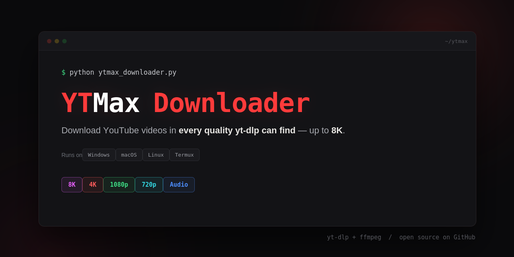

# 🔴 YTMax Downloader

A simple, colorful command-line YouTube downloader powered by [yt-dlp](https://github.com/yt-dlp/yt-dlp). Download videos in **any quality actually available** — up to **8K** — or grab audio only, right from your terminal.

Two editions are included:

| Edition | File | Platform |
|---|---|---|
| 📱 Termux | `ytmax_downloader.py` | Android (Termux) |
| 🖥️ Desktop | `ytmax_downloader_pc.py` | Windows, macOS, Linux |

```
__   _______ __  __              ____                        _                 _
\ \ / /_   _|  \/  | __ ___  __ |  _ \  _____      ___ __   | | ___   __ _  __| | ___ _ __
 \ V /  | | | |\/| |/ _` \ \/ / | | | |/ _ \ \ /\ / / '_ \  | |/ _ \ / _` |/ _` |/ _ \ '__|
  | |   | | | |  | | (_| |>  <  | |_| | (_) \ V  V /| | | | | | (_) | (_| | (_| |  __/ |
  |_|   |_| |_|  |_|\__,_/_/\_\ |____/ \___/ \_/\_/ |_| |_| |_|\___/ \__,_|\__,_|\___|_|
```

## ✨ Features

- 🎯 **Real quality detection** — probes each video and only shows resolutions that actually exist for it (no fake 8K options on a 1080p upload).
- 🌈 **Color-coded quality menu** — each tier gets its own color so you can scan it at a glance:

  | Quality            | Color          |
  |--------------------|----------------|
  | 8K (4320p)         | Bold Magenta ★ |
  | 4K (2160p)         | Bold Red       |
  | 2K / QHD (1440p)   | Yellow         |
  | Full HD (1080p)    | Green          |
  | HD (720p)          | Cyan           |
  | SD (480p)          | Blue           |
  | 360p / 240p / 144p | Gray           |

- 🎵 **Audio-only mode** — extract MP3 audio instead of video.
- 🔀 **Automatic video+audio merging** — handled via ffmpeg, needed for anything above 1080p since YouTube serves high-res streams separately.
- 📊 **Live progress** — percentage, speed, and ETA while downloading.
- 📁 **Smart save location** — auto-detects the right downloads folder per platform.
- 🖥️ **Windows-safe colors** — the desktop edition enables ANSI colors natively on Windows terminals, and gracefully falls back to plain text if colors aren't supported.

## 📋 Requirements

- Python 3.9+
- [ffmpeg](https://ffmpeg.org/) (for merging/audio extraction)
- [yt-dlp](https://github.com/yt-dlp/yt-dlp)
- Termux edition only: the [Termux](https://termux.dev/) app on Android

## 🚀 Installation

### Desktop (Windows / macOS / Linux)

```bash
pip install --upgrade yt-dlp

# ffmpeg:
#   Windows : winget install ffmpeg      (or: choco install ffmpeg)
#   macOS   : brew install ffmpeg
#   Linux   : sudo apt install ffmpeg    (or your distro's package manager)

git clone https://github.com/xauusd25/YTMax_Downloader.git
cd YTMax-Downloader
python ytmax_downloader_pc.py

```

### Termux (Android)

```bash
termux-setup-storage
curl -sS https://raw.githubusercontent.com/xauusd25/YTMax_Downloader/main/installer.sh | bash

```

## ▶️ Usage

1. Run the script for your platform.
2. Paste a YouTube video URL when prompted.
3. YTMax fetches the video info and shows every quality that's genuinely available for it.
4. Pick a resolution (or "Best available" / "Audio only").
5. Watch the live progress bar — your file lands in your downloads folder.
6. Choose to download another video or exit.

## ⚠️ Disclaimer

YTMax Downloader is a personal-use tool built on top of yt-dlp. Only download videos you have the right to download — your own content, content licensed for reuse, or personal/offline use where permitted by law. Respect YouTube's Terms of Service and copyright law in your country. The maintainers are not responsible for misuse.

## 🙏 Credits

- [yt-dlp](https://github.com/yt-dlp/yt-dlp) — the download engine this tool wraps
- [ffmpeg](https://ffmpeg.org/) — audio/video processing and merging

## 📄 License

This project is licensed under the [MIT License](LICENSE).
